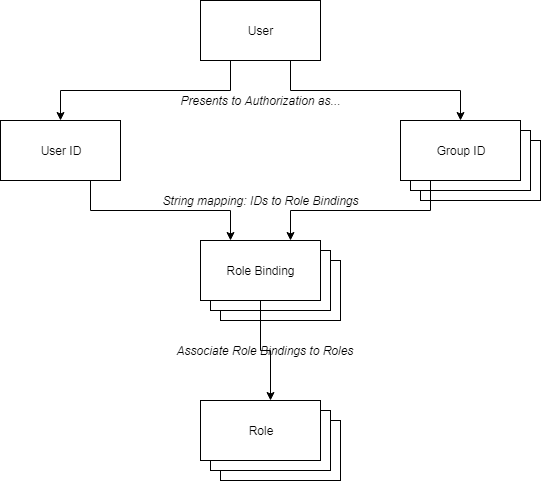

## Authorization

See:
* https://kubernetes.io/docs/reference/access-authn-authz/authorization/
* https://kubernetes.io/docs/reference/access-authn-authz/rbac/

Note that this discussion is simplified in some areas for introductory clarity.

Kubernetes uses a rich, granular, role-based access control (RBAC) mechanism to authorize requests made to the
API server (e.g. from kubectl). The RBAC process is tied intimately with the API; see
[API](./API.md "The Kubernetes API") for an introduction to the API.

Once [authenticated](./Authentication.md "Authentication"), a user is presented to the API server as a user ID plus one or
more group IDs. The IDs are opaque strings, known as subject IDs. When a user accesses the API API, Kubernetes maps the
subject IDs to Objects known as *RoleBindings*. The RoleBindings are simiple Objects which associate subject IDs to *Roles*.
See the diagram below.



By default, a subject has no privileges to use the API. A Role Object consists of a set of *rules*. A rule represents the
granting of API access privileges. A rule consists of three things:
* One or more apiGroups;
* One or more resources;
* One or more *verbs*.

The apiGroups are named API groups - see [Authentication](./Authentication.md "Authentication").

The resources are Kubernetes Objects, for example, "pods" or "deployments".

The verbs are actions which are available in the API. Example verbs are:
* get - get the details of an Object
* list - list Objects, i.e. query for multiple Objects
* update
* delete

Note that 'get' and 'list' are different flavours of the HTTP GET action.

A sample YAML file, for a ClusterRole (see more below) defintion, is:
```yaml
apiVersion: rbac.authorization.k8s.io/v1
kind: ClusterRole
metadata:
  name: cluster-role-pod-reader-1
rules:
- apiGroups: [""]	# empty because pods are in the default group
  resources: ["pods"]
  verbs: ["get", "watch", "list"]
```
This ClusterRole allows verbs "get", "watch", and "list" to be performed against "pods", which form part of the core
(empty string) apiGroup. Note that, as a Role, this definition has no association with a user or a group; a
RoleBinding is needed for that.

A RoleBinding binds a single Role to one or more users and/or to one or more groups. An example ClusterRoleBinding
is given below:

```yaml
apiVersion: rbac.authorization.k8s.io/v1
kind: ClusterRoleBinding
metadata:
  name: foo-cluster-role-pod-reader-1
subjects:
- kind: User
  name: foo@bar.com
roleRef:
  kind: ClusterRole
  name: cluster-role-pod-reader-1
  apiGroup: rbac.authorization.k8s.io
```

This ClusterRoleBinding grants to the user 'foo\@bar.com' the permissions specified in ClusterRole
'cluster-role-pod-reader-1'. Note that if roleRef.kind was given as Group the binding would be for a group
rather than a user. Note that multiple subjects (users and groups) may be given in a single RoleBinding.

Note that the Kubernetes RBAC system is pessimistic: an operation will fail unless the combination of a Role
and RoleBinding permits it. Deny style permissions are not needed.

Note that the RBAC mechanism Kubernetes uses employs four Object types: ClusterRoles, Roles, ClusterRoleBindings, and
RoleBindings. The Cluster* Objects are cluster-wide while the Role and RoleBinding objects are namespace-specific.
Some Objects (for example, Nodes) are inherently of cluster scope and so the Cluster* forms must be used for them.
Other Objects, like Deployments, are namespace-specific and so the non-Cluster forms are appropriate.

Clearly the authorization system is very rich. In a thoughtful environment the use of Roles and groups (and
namespaces) must be carefully planned and managed.

<p align="center"><a href="./Authentication.md">&larr;&nbsp;Previous</a>&nbsp;&vert;&nbsp;<a href="./Logging.md">Next&nbsp;&rarr;</a></p>
