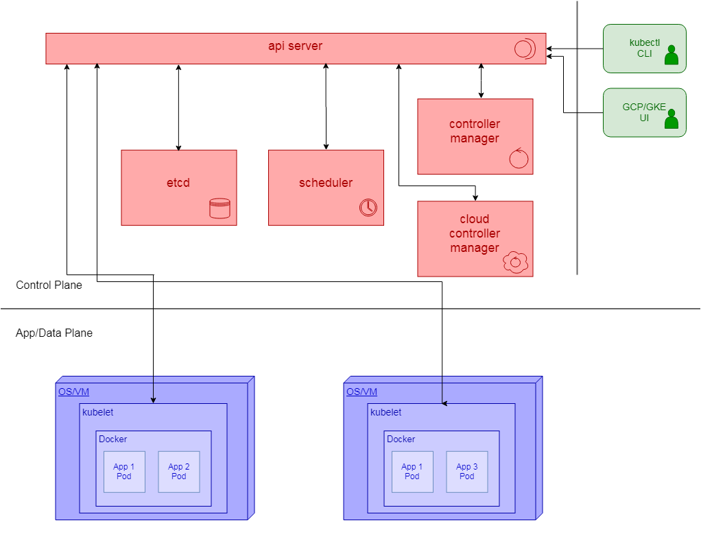

# kubernetes-research

## Purpose
The purpose of this repo is to capture Kubernetes research performed in March and April of 2019.
The goal of the research is to provide a knowledge foundation for Kubernetes and Google Kubernetes
Engine (GKE).

## Principal Online Documentation
The main Kubernetes docs are at http://kubernetes.io/docs. GKE docs are found at https://cloud.google.com/kubernetes-engine/docs.

## Scope

The scope of this document is to:
* introduce Kubernetes;
* discuss its architecture;
* present a solid introduction to Kubernetes and enough examples of usage such that a reader could get started
on the platform with little other knowledge;
* provide a basic reference to Kubernetes, including links to other information;
* discuss some of the specifics of Kubernetes on the Google cloud (GKE).

While all of the major cloud platforms support Kubernetes, Google Kubernetes Engine (GKE), which runs on top of
Google Cloud Platform (GCP), was chosen as the target platform for this study because of Google's close experience
with Kubernetes. Application portability is a Kubernetes goal and so an effort has been made in this document to
separate out the GKE specifics from the Kubernetes generalities.

## Overview

Kubernetes is a sophisticated, rich application orchestration system which provides the mechanisms to execute and
coordinate containerized applications (think Docker) in a distributed fashion across a clustered environment. It
brings predictability, scalability, management, and high availability, all in a portable ecosystem. Its offerings
straddle both Platform as a Service (PaaS) and Infrastructure as a Service (IaaS) (without furnishing a complete
solution for either).

Kubernetes can be considered to be portable because it provides a logical application architecture which can run
on any Kubernetes implementation. All of the major logical constructs (Kubernetes Objects) are defined at a
high-enough level and are complete enough such that most applications (excepting the complex ones) can run on
it with little regard for the underlying operating environment or the Kubernetes implementation itself. Indeed,
that abstraction is one of the foundational motivations for the system.

That being said, it should be noted that Kubernetes is a complex system and is not easily mastered. It
was designed to run in managed environments and, for most purposes, it is strongly recommended that it be
provisioned in the cloud, rather than in a custom, in-house implementation. The task of bootstrapping Kubernetes
up, and providing implementations in support of all of the Objects, is a large one and is best left to specialists.

Kubernetes provides a framework, based on Google's best practices, for managing:

* containers, i.e. Docker;
* applications, including zero-downtime deployments and declarative specification;
* networking;
* storage;
* resource management;
* health montoring and healing;
* scalability;
* fault tolerance;
* logging, including application and audit;
* monitoring.

Kubernetes does not provide:
* Application build facilities and CI/CD;
* Application-level services, such as databases, middleware, or frameworks (such as Enterprise Java);

But it does provide a platform for such services!
* Physical or virtual machine management.

Kubernetes is an open-source system written in Go. It was developed originally by Google and is now managed
by the Cloud Native Computing Foundation and is available on all major cloud platforms. It is under very active
development, which is both good (momentum) and bad (fast-moving; documentation challenges). Kubernetes has
bested Docker Swarms as the dominant distributed container technology. It provides high-level infrastructure
and application abstractions which can make applications largely portable across providers, whether cloud-based
or in-house. It is particularly well-suited to support, and indeed engenders the use of, microservices.

## Declarative vs. Imperative Management

Declarative Object management is fundamental to Kubernetes. A declarative approach may be contrasted with an
imperative approach as follows:

Declarative: "I want a service with the given properties to be available in my system"
* "Be like this"

Imperative: "Create a service with the following properties"
* "Do this"

In an imperative approach, the author must always be explicitly aware of:
* The current state of the system;
* The desired state of the system;
* How to transform the system from the current to the desired state (complex).

In Kubernetes's declarative approach, the system handles steps 1 and 3, and all the user needs to do is express
the desired final state of the application.

The declarative approach is fundamental in Kubernetes. In some cases both declarative and imperative approaches
exist, but the declarative one should **always** be chosen over imperative. A declarative statement of configuration
is sometimes called a *Manifest*.

Note that declarative configurations are self-documenting and lend themselves well to version control, in contrast
with imperative statements. Note that a weakness is that you cannot declaratively delete an Object; nevertheless,
imperative approaches should be used for creation and updating.

## Overall Architecture

This section discusses the high-level software architecture of the Kubernetes implementation itself. It is good to
have this overview, but if you're working in the cloud (e.g. GKE) you don't initially need more than a passing
understanding of the concepts (which is all you’ll get from this document).

Kubernetes consists of *Master* or *Control* Nodes, plus regular *Nodes*. Master Services run on the Master nodes, which
comprise the *Control Plane*. Apps run on the (regular) Nodes, which comprise the *Data Plane* or *Application Plane*.
The Control Plane components perform overall coordination ("orchestration") while the Data Plane components are focused
on granular application execution

The high-level component architecture of Kubernetes is depicted below.


### Master Services

The principal master services are:
* kube-apiserver
* etcd
* kube-controller-manager
* kube scheduler
* cloud controller-manager

#### kube-apiserver

The API server is often likened to the (memory-less) brain of Kubernetes. It is the front end for the control
plane. Its interface is RESTful YAML. YAML configuration is declarative,
not imperative. The API server acts as the endpoint for both external user connectivity to the Kubernetes cluster as
well as for many of the internal, intra-component communication needs. The API server is the only component which
interfaces directly with etcd:

* the API server uses etcd’s watch service to detect divergences in the cluster state (e.g. Nodes going down);
* the API server updates etcd with declarative, desired state;
* the API server queries etcd for declarative state.

The API server manages user authentication and authorization.

The kube-apiserver can scale horizontally.

Some intra-control-plane communication, e.g. between the API server and etcd, seems to be done via gRPC calls (rather
than RESTful YAML), although this isn’t entirely clear.

#### etcd – the cluster store

Kubernetes configuration information is stored in the Cluster Store, which is based on the distributed, in-memory,
key-value data store etcd. The cluster store is the only stateful component in the control plane, and as such it
stores both the current and desired states of the system, as well as the current state of nodes. Like Kubernetes
itself, etcd is a project of the Cloud Native Computing Foundation (CNCF).

Acccording to https://en.wikipedia.org/wiki/Kubernetes#Kubernetes_control_plane_(primary), etcd favours Consistency
over Availability (think CAP theorem) in order to ensure correct operations. Another reference \[*The Kubernetes Book*;
Nigel Poulton\] says that etcd prefers Consistency over Availability and does not tolerate a “split-brain” situation.
If such a situation arises, Kubernetes will halt updates to the cluster; however, applications should continue to work.

Etcd achieves consistency through the use of the RAFT consensus algorithm and a highly-available replicated log. 
Etcd is written in Go and its interface is gRPC.

#### kube-controller-manager

The Kubernetes Controller Manager (KCM) implements multiple, orthogonal *Control Loops*, each of which monitors the
cluster in some way and responds to events which occur. Examples of events are: a new Deployment being created; a
Node going down; a Node reporting that a Container has exited. Control loops drive actual cluster state towards
the desired state.

Some of the control loops include:
* Node controller
* DaemonSet controller
* Jobs controller
* Endpoints controller
* ReplicaSet controller
* Namespace controller
* Service accounts controller

Control loops are also known as *Watch Loops* or *Reconciliation Loops*.

Control loops are orthogonal in that each is specialized to monitor one aspect of Kubernetes. Each controller
takes care of its own task and does not consider events outside of its domain. Each control loop watches the
state of the cluster and makes changes to move the current state of the sysgtem into the desired state. Control
loops manage state as follows:

1. Obtain desired state;
2. Observe current state;
3. Determine differences;
4. Reconcile differences.

This logic is at the heart of Kubernetes’s declarative design pattern.

#### kube-scheduler

The *Scheduler* is responsible for scheduling Pods on Nodes. It looks for new work tasks and assigns them to
appropriate, healthy nodes. The scheduling of pods is distinct from the running of them; running is not performed
by kubelets. The Scheduler determines which data plane nodes are capable of running a given pod, and then scores
them in order to determine which nodes are best to run the pod on. Scoring/ranking includes such things as: free
resources; does the node have the pod already; and number of running pods. Scheduling is an optimization problem.

Note that the Scheduler is a key component in supporting the declarative execution of Pods.

#### Cloud-controller-manager

The *Cloud Controller Manager* (CCM) is similar to the Controller Manager except it houses control loops which
are cloud-dependent. The CCM manages integrations with underlying cloud technologies and services such as
load-balancers and storage. At the time of writing, it seems that there is some flux between the KCM and the CCM.

### Other Services

#### kubelet

The *kubelet* is a container-focused service which runs on every data-plane node and is responsible for running
and monitoring Pods on that Node. The kubelet interfaces with Docker to run applications.

#### System Pods

Where possible, other core Kubernetes services run as Pods on Nodes. Some examples of such services
include:
* DNS
* log collection
* performance monitoring and metrics collection
* *kube-proxy* – maintains network routing rules (ipvs) and performs connection forwarding, routing network
traffic to the appropriate Pods based on their IP addresses and ports.

### User Interfaces

The primary user interface for Kubernetes, on any implementation, is a command-line tool called kubectl. kubectl is
a command-line interface to the kube-apiserver. kubectl is provided as part of the Kubernetes distribution and
it may be used against any Kubernetes implementation (e.g. GKE, 

#### kubectl

The primary functions of kubectl are to:
* make declarations of new (desired) system state;
* query the system for desired state;
* query the system for current state;
* query the system for logs;
* authenticate users for the above operations.

kubectl can be used to manipulate application Objects in an imperative manner, but this should be strictly avoided.

If you’re working with Kubernetes, you **will** be working in the kubectl CLI – no web application exists to manage the
wide range of Kubernetes application Objects.

kubectl is discussed further in [kubect.md](./kubectl.md "kubectl.md").

See https://kubernetes.io/docs/reference/kubectl/cheatsheet/.

#### GCP/KE UI

As part of its [Google Cloud Platform (GCP) UI](https://console.cloud.google.com "GCP Home"), Google provides a
basic Kubernetes Engine UI, GCP/KE, for viewing and manipulating some basic Kubernetes functionality. Within GCP,
the KKE UI is found at Main Menu &rarr; Kubernetes Engine. GCP/KE is by no means complete and so kubectl is the
primary user interface. Significantly, GCP/KE can be used to view performance metrics and logs.

To create your own Kubernetes cluster on Google Kubernetes Engine (GCP/KE), follow the instructions here:
[Create your Own Kubernetes Cluster on GCP/KE](./create_gke_cluster.md "Create your Own Kubernetes Cluster on
GCP/KE").

## Kubernetes Objects

### Overview

Kubernetes *Objects* are the core application-level entities within the system; they define your application
components and structure to Kubernetes. They may be seen as persistent “records of intent” within the declarative
model - whenever differences exist between the current Object state (the *status*) and the declared,
desired state (the *spec*), the various Kubernetes control loops and the scheduler work to drive the system towards the
desired state. Ignoring system version differences, Objects are portable across Kubernetes implementations.

Kubernetes end users will work primarily with Objects, creating, updating, reading, and deleting them (in a declarative
fashion, of course). Objects are the building blocks for applications, and so it is critical to understand what kinds
of Objects are available and what their capabilities are.

This site has been designed so that you can easily try out the accompanying YAML examples in your own Kubernetes
cluster. To create a cluster on Google Cloud Platform, see
[Create your Own Kubernetes Cluster on GCP/KE](./create_gke_cluster.md "Create your Own Kubernetes Cluster on
GCP/KE").

YAML definition files are applied as per the following examples:  
&nbsp;&nbsp;&nbsp;`kubectl apply -f YAMLFILE`	# create Objects from YAMLFILE
&nbsp;&nbsp;&nbsp;`kubectl delete YAMLFILE`		# delete Objects from YAMLFILE
&nbsp;&nbsp;&nbsp;`kubectl apply -f - < YAMLFILE`

Active Objects may be viewed per the following examples:
&nbsp;&nbsp;&nbsp;`kubectl get KIND`                # list Objects of kind KIND
&nbsp;&nbsp;&nbsp;`kubectl get KIND NAME`           # show high-level info about the named Object
&nbsp;&nbsp;&nbsp;`kubectl describe KIND NAME`      # show more detailed info about the named Object
&nbsp;&nbsp;&nbsp;`kubectl get -o yaml KIND NAME`   # get yaml spec and status for the named Object

Objects are also called *Resources*.

The *kinds* ("kind" being a Kubernetes concept) of Objects discussed in this document are:
* Nodes
* Namespaces
* Pods and Containers
* Deployments
* StatefulSets
* DaemonSets
* Jobs and CronJobs
* HorizontalPodAutoscalers
* Services
* Ingresses
* PersistentVolumes and PersistentVolumeClaims
* StorageClasses
* ConfigMaps
* Secrets
* Roles and RoleBindings

This is not an exhaustive set of Objects, but these are the principal ones for applications.

### Object Metadata

#### Labels and Label Selectors

*Labels* are metadata key/value pairs which are associated with Objects. They are used for identifying Objects,
particularly in groups. Key syntax is \[domain-name/\]label-name, where \[domain-name\] is optional. Some label
examples are:
&nbsp;&nbsp;&nbsp;`environment: "dev"`  
&nbsp;&nbsp;&nbsp;`release: "stable"`  
&nbsp;&nbsp;&nbsp;`microservice: "authentication"`

A recommended label strategy may be found at https://kubernetes.io/docs/concepts/overview/working-with-objects/common-labels/ .

*Label Selectors* are used to select sets of objects based on their labels. Example selectors are:
&nbsp;&nbsp;&nbsp;`environment = prod`  
&nbsp;&nbsp;&nbsp;`tier != frontend`  
&nbsp;&nbsp;&nbsp;`microservice in (authentication, foobar)`  
&nbsp;&nbsp;&nbsp;`KEY`	# select items which have the given key defined

Other selectors include `notin`, Multiple selectors may be used in one selection. An example kubectl usage is:  
&nbsp;&nbsp;&nbsp;`kubectl get pods -l environment=production,tier=frontend`

Selectors are used in (YAML) service definitions as follows:
```yaml
selector: {
    component : redis
}
```

Label Selectors are used, for example, in Services to associate Pods with Services, defining the set of Pods which
fulfill a Service.

#### Field Selectors

Field Selectors are another way of selecting Objects. They are similar to Label Selectors but they can access any
field in the Object spec or status. An example is:  
&nbsp;&nbsp;&nbsp;`kubectl get pods --field-selector status.phase=Running`

#### Annotations

Annotations are another form of metadata which may be associated with objects. Annotations are descriptive and
are not used to identify and select objects. The metadata in an annotation can be small or large, structured or
unstructured, and can include characters not permitted by labels.

### Nodes

See:
* https://kubernetes.io/docs/concepts/architecture/nodes/

Nodes represent computing resources (virtual or physical machines) on which Pods may run. Typically a Node is
a VM in the cloud environment. Nodes cannot be created via Kubernetes – they must be created externally in
the cloud environment and then assigned to Kubernetes. See
[Create a Node Pool in GKE](./gke_create_node_pool.md "Create a Node Pool in GKE).

Nodes may be queried in Kubernetes; the following are typical kubectl commands:  
&nbsp;&nbsp;&nbsp;`kubectl get nodes`  
&nbsp;&nbsp;&nbsp;`kubectl get -o yaml node NAME`  
&nbsp;&nbsp;&nbsp;`kubectl describe node NAME`

### Namespaces

See:
* https://kubernetes.io/docs/concepts/overview/working-with-objects/namespaces/
* https://cloud.google.com/blog/products/gcp/kubernetes-best-practices-organizing-with-namespaces

*Namespaces* provide a mechanism to define scopes which logically separate Objects by scope name within Kubernetes.
At a simplistic level, a namespace can be viewed as an isolated, virtual cluster.

Namespaces seem like a good way to separate development users, however the Kubernetes documentation provides the
following advice: “Namespaces are intended for use in environments with many users spread across multiple teams,
or projects. For clusters with a few to tens of users, you should not need to create or think about namespaces at
all. Start using namespaces when you need the features they provide.” Personally Namespaces sound like a good idea
to keep developers from disrupting one another.

Namespaces should not be used to delineate between dev/qa/prod regions: different clusters should be established
for each region.

If you use Namespaces, there is an implication on DNS domain names. The fully-qualified domain name of a Service
is of the form: `service-name.namespace-name.svc.cluster.local`. If you refer to a Service with just service-name,
it resolves to a service in the current namespace.

Resource limits may be applied to Namespaces, via Resource Quotas. Resource quotas are not discussed in this document.

The Namespace is a part of the current kubectl context.

This [sample Namespace YAML](./Namespaces/namespace.yaml "Sample Namespace YAML") creates a Namespace which is
named ‘namespace1’ and which has a Label name=”namespace1”.

   
Common kubectl namespace commands include:  
&nbsp;&nbsp;&nbsp;`kubectl get namespaces [--show-labels]`  
&nbsp;&nbsp;&nbsp;`kubectl config set-context CONTEXT-NAME --namespace=NAMESPACE`  
&nbsp;&nbsp;&nbsp;`kubectl get pods –namespace=NAMESPACE`

The default namespace (if none is given) is named ‘default’.

### Pods and Containers

See:
* https://kubernetes.io/docs/concepts/workloads/pods/pod-overview/

*Pods* are the smallest application deployment objects in Kubernetes. Pods run on Nodes. Pods run in Docker and
contain one (usually) or more *Containers*. Each Container contains a single Docker image. Each Pod runs one instance
of an application, for example a web application. Multiple Pods are used to scale horizontally.

Generally Pods only have one Container in them. Occasionally two (or, rarely, more than two) Containers might
be deployed in a Pod if the Containers are tightly coupled. Note that there is a special kind of container called
an initContainer which can perform initialization for a regular container.

Pods have unique storage resources and network addresses. Each Pod gets its own IP address. Containers within a Pod
share the same: IP address; network namespace; and set of ports. Containers within a Pod may communicate with each
other through localhost.

Two Containers within a Pod do not share storage space; if you want to do that, you must explicitly arrange for
it via PersistentVolumeClaims.

Pods may appear and disappear (e.g. due to failure or resource constraints) and should be treated as ephemeral
entities. Pods are generally not created directly by the user, but rather they are created as sub-Objects from
a Controller. Creating a Pod directly results in a single point of failure (although Kubernetes will attempt
to repair the broken Pod); Pods are typically only used directly for situations which require persistent storage,
like a mysql server. A higher-level Controller should be used whenever possible: a Deployment, StatefulSet,
DaemonSet, Job, or CronJob; see Controllers, below.

### Controllers

Deployments, StatefulSets, DaemonSets, Jobs, and CronJobs are all types of Pod Controllers. This overloads the
term “Controller”, but the meaning should be clear from the context. All Controller definitions contain template
Pod definitions. Those templates are used to create Pods within the Controller.

Note that Deployments are one of the most important Object types in Kubernetes.

#### Deployments

Deployments are perhaps the most common kind of Controller. A Deployment specifies that a number of identical
Pods be scheduled for creation and execution. Deployments do not say where the Pods are to be run; that is
determined by the Scheduler. A common example of a Deployment is a web application.

Deployments are one of the most important use cases for declarative configuration. Deployments allow you to:
* Grow or shrink the number of Pods to adjust for load;
* Rollout new versions of the Pod/Container images;
* Rollback an image update.

kubectl get --watch deployment

#### StatefulSets

...

####DaemonSets

...

#### Jobs and CronJobs

See:
https://kubernetes.io/docs/concepts/workloads/controllers/jobs-run-to-completion/
https://kubernetes.io/docs/concepts/workloads/controllers/cron-jobs/
HorizontalPodAutoscaler

...

### Services

...

See https://medium.com/google-cloud/understanding-kubernetes-networking-services-f0cb48e4cc82 and https://kubernetes.io/docs/concepts/services-networking/service/ for interesting explanations of how Services are actually implemented using IPVS routing rules.

### Ingresses

...

### PersistentVolumes and PersistentVolumeClaims

See:
* https://kubernetes.io/docs/concepts/storage/persistent-volumes/
* https://cloud.google.com/kubernetes-engine/docs/concepts/persistent-volumes

Kubernetes’s *PersistentVolume* and *PersistentVolumeClaim* Objects are the mechanisms to give applications
persistent storage. A PersistentVolume represents actual storage. A PersistentVolumeClaim is a ticket for a Pod to
use a PVC.

To use a PersistentVolume, a disk resource must first be created in the cloud provider. The PersistentVolume makes
the disk known to Kubernetes, and the PersistentVolumeClaim allows an association between Pods and the PersistentVolume.

**Note that what follows in this section is a nuisance. There is a better way to do this which will be explained in
StorageClasses, below.**

#### Gke disk creation

To create a Google Compute Engine disk, follow the instructions [here](./PersistentVolumes/gke_disk_creation.md "GCE
Disk Creation").

#### Kubernetes Volume Creation

Now that we have the disk created and formatted (phew!)...

Create a PersistentVolume with
[./PersistentVolumes/pv-disk-persistentvolume.yaml](./PersistentVolumes/pv-disk-persistentvolume.yaml "Create a PersistentVolume").
Create a PersistentVolumeClaim with
[./PersistentVolumes/pv-disk-persistentvolumeclaim.yaml](./PersistentVolumes/pv-disk-persistentvolumeclaim.yaml "Create a PersistentVolumeClaim").
Then view the PVC in GCP at Main Menu &rarr; Kubernetes Engine &rarr; Storage &rarr; PersistentVolumeClaims.
Create a Deployment which uses that PVC with
[./PersistentVolumes/pv-disk-deployment.yaml](./PersistentVolumes/pv-disk-deployment.yaml "Create a Deployment for the PVC").
Wait for that Deployment to finish.

To see the mounted disk within a Pod of the Deployment, perform the following steps:
```
kubectl get pods -l app=pv-disk	    # list pods
# Copy one of the pods’ names.
Kubectl exec -it POD-NAME sh		# open shell in that pod
ls -aCFl /pv-disk-volume            # here your command executes within the Container of the Pod (docker magic)
mount | grep pv-disk-volume		    # look at the mounts
```

Note that this example creates a multiply-mounted (multiple pods), read-only disk volume. You can also create
a singly-mounted read-write volume, e.g. for a database server. To create a multiply-mounted, read-write volume,
you must use something like NFS. I did not explore NFS.

### StorageClasses
See:
* https://kubernetes.io/docs/concepts/storage/storage-classes/
* https://cloud.google.com/kubernetes-engine/docs/how-to/persistent-volumes/ssd-pd
* https://cloud.google.com/kubernetes-engine/docs/concepts/persistent-volumes
* https://cloud.google.com/kubernetes-engine/docs/how-to/persistent-volumes/regional-pd

The problem with the PersistentVolume approach is that it doesn’t scale well – for each PVC which is created,
a disk must be provisioned, formatted, and managed in the back end (e.g. in the cloud provider). *StorageClasses*
provide a way of bypassing the cloud-specific disk creation step so that volumes may be created completely
declaratively.

Note that there is a default storage class on GKE named “standard”. You can see this in GCP &rarr; GKE &rarr;
Storage &rarr; Storage Classes, or in `kubectl get sc`. In GKE the standard storage class uses standard
(non-SSD) disks.

To create an SSD storage class, look at [StorageClasses/storageclass.yaml](./StorageClasses/storageclass.yaml "Create a Storage Class").
To create a singly-mounted, read-write PersistentVolumeClaim in that class, see
[StorageClasses/storageclass-pvc.yaml](./StorageClasses/storageclass-pvc.yaml "Create a PVC for a StorageClass").
To create a single Pod which mounts that claim, see
[StorageClasses/storageclass-pod.yaml](./StorageClasses/storageclass-pod.yaml "Create a Pod for a Storage Class").

### ConfigMaps

...

### Secrets

...

## The Kubernetes API

...

## Authentication

### Introduction

Kubernetes does not store users or groups as Objects (entities) in the system. Instead, it extracts user and
group (subject) information from the authentication protocol and then associates the resulting opaque string
subject ID with roles in a rich REST-based RBAC scheme.

A real-world authentication and authorization implementation will use groups heavily; these should be well planned
in advance.

Possible authentication mechanisms include HTTP(S) Basic Authentication, Bearer tokens, OpenID Connect, and x509
client-side certificates. Note that OIDC can facilitate integration Active Directory with Kubernetes. This document
discusses OIDC/OAuth2 and client-side certs.

Client-side certificates are not recommended for use in a real project, because there is no way in Kubernetes to
revoke a certificate. Once access is granted via a particular certificate, it will always be available. OIDC is
the recommended authentication mechanism.

Kubernetes is - when used properly - a highly secure system, with authentication and authorization utilized
intra-system-components, as well as between admin users (presumably using kubectl) and the system. For example, all
kubelets authenticate with the API server and with other control-plane components as needed. All communication,
intra and inter, should be TLS.

Kubernetes does not store user and group entities. Rather, a user ID and zero or more group IDs are extracted from
the authentication process (i.e. client-side certs). Note that service accounts, which are stored as objects/entities
in Kubernetes, should not be used for CLI interactions. Following good practices, service accounts are strictly for
use in intra-component communications.

### x509 Certificates

PKI infrastructure is therefore built into Kubernetes from the ground up. The generation and use of client-side
certificates is straightforward.

An x509 certificate carries a common name (/CN=) and zero or more organizations (/O=). The common name is the
Kubernetes user ID and the organizations are the groups. The certificates must be signed by the Kubernetes PKI
infrastructure itself; a facilitating API exists and is accessible from kubectl.

Upon authentication of a user, the API server (which kubectl talks to) validates the certificate and extracts the
user and group IDs. It then authorizes the request (see below) and either rejects or processes it. Again, note that
users and groups are not "objects" or entities in Kubernetes; they are simply strings.

Creation of a user involves the following steps:
1. Create a private key;
2. Generate a Certificate Signing Request (CSR);
3. Accept/sign the CSR;
4. Extract and save the resulting, signed certificate;
5. (Presumably) configure the certificate into kubectl.

A script [create-cert.sh](./Authentication/create-cert.sh "create-cert.sh") has been created to perform the first
four steps. A script [kubectl-config.sh](./Authentication/kubectl-config.sh "kubectl-config.sh") has been
created to perform the last step. The first script in particular is not for use outside of development.

### OpenID Connect
OpenID Connect, or OIDC, is the preferred authentication mechanism. OIDC supports both users and groups.
Apparently Kubernetes OIDC can interface with Active Directory, but that has not been explored.

#### GCP/KE Considerations
While Kubernetes has no notion of user or group entities (again, it only knows them as opaque strings), GCP/KE does
have user and group entities, and they must be used in the setup of OIDC. Users and groups serve two purposes in
GCP/KE:
1. Authentication and authorization for the GCP/KE web-based UI;
2. Authentication and authorization for kubectl/gcloud communications with the GCP/KE backend.

I will refer to these users and groups as GCP users and GCP groups.

GCP users are Google Account users. GCP groups are Google Groups. Both have e-mail addresses associated with
them, e.g. someone\@gmail.com or somegroup\@googlegroups.com. Note that Google Accounts may be associated with
any e-mail address and so strictly they do not have to be in the domain gmail.com.

So, outside of Active Directory / LDAP, to manage groups you need to manage Google Groups.

To associate a Google Account or Group with GCP the admin user navigates to GCP Main Menu &rarr; IAM and admin
&rarr; IAM. Click the Add button near the top and enter in the e-mail address of the user or the group. The suggested
initial roles to add are `Project.Viewer` and `Kubernetes Engine.Kubernetes Engine Developer`, but more research needs to
be done here. Again, these credentials and permissions control communication between gcloud/kubectl and the backend,
and I believe they also control permissions on the GCP/KE UI.

### kubectl config
kubectl is the primary Kubernetes administration tool; it is a CLI. To handle real-world use cases, it is possible
to associate multiple clusters, namespaces, and users together into *contexts*. Users can easily switch contexts,
changing the environment they're operating against.

kubectl config information is stored in `~/.kube/config`, in yaml format. The kubectl CLI has a set of commands
which simplify the management of the config file and the use of clusters, namespaces, and users. See
`kubectl config --help`.

...

## Authorization

Note that this discussion is simplified in some areas for introductory clarity.

Kubernetes uses a rich, granular, role-based access control (RBAC) mechanism to authorize requests made to the
API server (e.g. from kubectl).

Some discussion of the API is warranted. The Kubernetes API is REST-based. Each RESTful command has a method
(e.g. HTTP methods: GET, POST, PUT, DELETE) and a yaml payload. The method identifies the action to be taken
with the YAML and the payload contains the details of the Object against which the action is performed.

A sample yaml payload, for a ClusterRole (see more below) defintion, is:
```yaml
apiVersion: rbac.authorization.k8s.io/v1
kind: ClusterRole
metadata:
  name: cluster-role-pod-reader-1
rules:
- apiGroups: [""]	# empty because pods are in the default group
  resources: ["pods"]
  verbs: ["get", "watch", "list"]
```
An HTTP POST would be used to create this ClusterRole. The ClusterRole allows verbs "get", "watch", and "list" to
be performed against "pods", which form part of the core (empty string) apiGroup.

Every valid Kubernetes yaml payload contains the following top-level entry:  
&nbsp;&nbsp;&nbsp;`apiVersion: [API-GROUP/]version`  
Examples are:  
&nbsp;&nbsp;&nbsp;`apiVersion: apps /v1`  
&nbsp;&nbsp;&nbsp;`apiVersion: v1  
&nbsp;&nbsp;&nbsp;`apiVersion: rbac.authorization.k8s.io/v1`

If API-GROUP is omitted the reference is to the core API group. The apiVersion identifies the version of the
"schema" (yaml expectations) for the given API group. Management of Kubernetes Objects is divided into API groups.
The yaml payload must be in conformance with the apiVersion.

Version 1.14 of the api may be found here: https://kubernetes.io/docs/reference/generated/kubernetes-api/v1.14/ .

Authorization is based on: the user/groups; the namespace; the Object type (e.g. Pod, Deployment, Secret, ...) and
the verb. If a user has permission to perform the action on the Object in the namespace, the RESTful call will
proceed. Otherwise it will fail.

The RBAC mechanism Kubernetes uses employs four Object types: ClusterRoles, Roles, ClusterRoleBindings, and
RoleBindings. The Cluster* Objects are cluster-wide while the Role and RoleBinding objects are namespace-specific.
Some Objects (for example, Nodes) are inherently of cluster scope and so the Cluster* forms must be used for them.
Other Objects, like Deployments, are namespace-specific and so the non-Cluster forms are appropriate. The following
discussion is based on Roles and RoleBindings; the extension to Cluster* is straightforward.

A Role Object defines:
* A single namespace;
* One or more Object types ("resources");
* One or more RESTful verbs (actions).

Note that Roles have no association to users or groups.
A RoleBinding binds a single Role to one or more users and/or to one or more groups. An example ClusterRoleBinding
is given below:

```yaml
apiVersion: rbac.authorization.k8s.io/v1
kind: ClusterRoleBinding
metadata:
  name: foo-cluster-role-pod-reader-1
subjects:
- kind: User
  name: foo@bar.com
  apiGroup: rbac.authorization.k8s.io
roleRef:
  kind: ClusterRole
  name: cluster-role-pod-reader-1
  apiGroup: rbac.authorization.k8s.io
```

This ClusterRoleBinding grants to the user 'foo\@bar.com' the permissions specified in ClusterRole
'cluster-role-pod-reader-1'. Note that if roleRef.kind was given as Group the binding would be for a group
rather than a user. Note that multiple subjects (users and groups) may be given in a single RoleBinding.

Note that the Kubernetes RBAC system is pessimistic: an operation will fail unless the combination of a Role
and RoleBinding permits it. Deny style permissions are not needed.

Clearly the authorization system is very rich. In a thoughtful environment the use of Roles and groups (and
namespaces) must be carefully planned and managed.

## Auditing and Logging

...

## Resource Allocation and Monitoring

...


